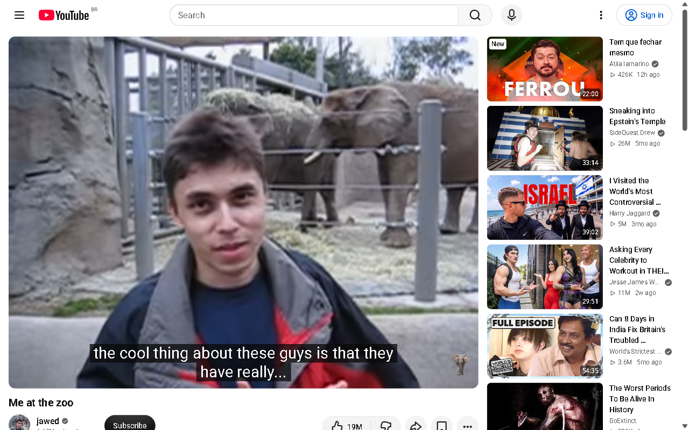

# Karaoke MP3 Downloader

🇧🇷 [Português (Brasil)](README.pt-BR.md)

A fork of [Triangle-Downloader](https://github.com/HelpFreedom/Triangle-Downloader), simplified for my dad — an amateur karaoke singer who uses YouTube as his songbook. One button: **Download MP3**.



## What it does

- Adds a **⬇ Download MP3** button to the YouTube player, on `youtube.com/watch` pages.
- One click saves the whole track as a 192 kbps MP3, with title and artist tags, into `Downloads\Songs to sing` (`Downloads\Músicas para cantar` when Chrome is in Portuguese). A **Open folder** button shows the file when it is done.
- Everything happens inside the browser: the audio the player is already streaming is captured and converted with ffmpeg.wasm. No external service, no yt-dlp, nothing else to install.
- The interface follows Chrome's language: English by default, Brazilian Portuguese automatically.
- Once a day it checks GitHub for a newer release and says so.

## Requirements

- Google Chrome (or another Chromium browser that loads unpacked extensions). The one-line installer is for Windows; on other systems unzip the release and "Load unpacked".
- An ad blocker that stops YouTube ads: **uBlock Origin Lite in "Complete" mode on youtube.com**. YouTube injects ads into the same stream as the song, so an ad that starts during a download cancels it (the message says so).

## Install (Windows)

1. Open PowerShell and paste this line:

   ```powershell
   irm https://raw.githubusercontent.com/alex-vinny/karaoke-mp3-downloader/main/install.ps1 | iex
   ```

   It downloads the latest release into `%LOCALAPPDATA%\KaraokeMP3\extension`, creates the songs folder and two desktop shortcuts (**Songs to sing** and **Update Karaoke MP3**), copies the extension path to the clipboard and opens `chrome://extensions`. No admin rights needed.

2. In `chrome://extensions`: turn on **Developer mode** (top right) → **Load unpacked** → paste the path (Ctrl+V) → Enter.

3. Open any video on YouTube. The button sits in the player's bottom-right controls.

If Chrome shows a "Disable developer mode extensions" notice when it starts, click **Cancel**.

Manual install: download `karaoke-mp3-downloader.zip` from the [latest release](https://github.com/alex-vinny/karaoke-mp3-downloader/releases/latest), unzip it anywhere, then "Load unpacked" as above.

## Update

Double-click **Update Karaoke MP3** on the desktop (it runs the same line as the installer) and reopen Chrome. When a newer release exists, the extension shows "Update available" on YouTube once a day.

## If it stops working

- YouTube changes its player often. Update first.
- The message on screen carries a short code and the version, for example `Something went wrong (E1, v1.0.0)`:
  - **E1** — the capture failed (network, or YouTube changed something).
  - **E2** — the conversion or the save failed.
  - **"An ad started playing"** — the ad blocker let an ad through. Set uBlock Origin Lite to "Complete" on youtube.com.
- Reload the page (F5) and try again. Keep the tab open while it runs; closing it aborts the download.
- Still stuck? Tell whoever set it up for you the code, the version and the video link.

## Limits

- Only on `youtube.com/watch` pages (not Shorts).
- Converting is a single-thread re-encode: about a minute for a 4-minute song, longer for hour-long mixes.
- No toolbar icon: everything happens inside the player.

## For developers

```sh
npm install
npx playwright install chromium
npm test                              # unit tests (node --test) + end-to-end (Playwright, headed)
KMD_LANG=en-US npx playwright test    # end-to-end in English (default: pt-BR)
```

The end-to-end test loads `extension/` unpacked into Playwright's Chromium, downloads a 19-second video and checks the MP3 and its tags. It runs locally only — YouTube blocks datacenter IPs. Releases are published by GitHub Actions on a `v*` tag. Decisions and status: [`specs/PLAN.md`](specs/PLAN.md).

## Credits and licence

Based on [Triangle-Downloader](https://github.com/HelpFreedom/Triangle-Downloader) by HelpFreedom: the capture hook and the ffmpeg.wasm pipeline are theirs; this fork removes the menu, adds the folder, the tags, the languages and the installer. Licensed under the GPL-3.0, see [`LICENSE`](LICENSE). Uses [ffmpeg.wasm](https://github.com/ffmpegwasm/ffmpeg.wasm).
