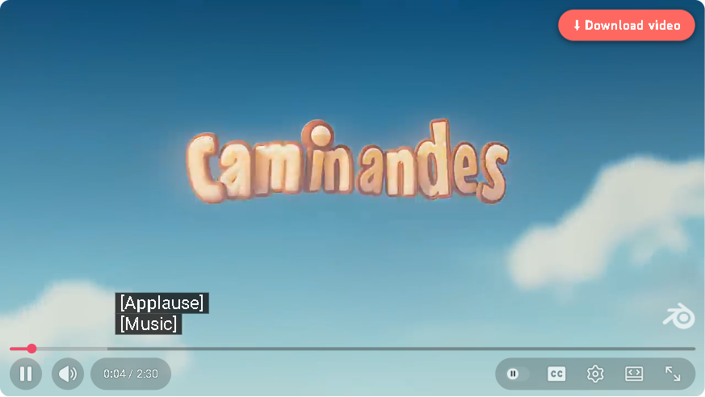
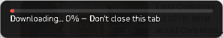
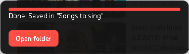

# Karaoke Downloader

🇧🇷 [Português (Brasil)](README.pt-BR.md)

A fork of [Triangle-Downloader](https://github.com/HelpFreedom/Triangle-Downloader), simplified for my dad — an amateur karaoke singer who uses YouTube as his songbook. One button: **Download video**.



| While it works | When it is done |
|---|---|
|  |  |

## What it does

- Adds a **⬇ Download video** button to the YouTube player, on `youtube.com/watch` pages.
- One click saves the whole video as a 720p MP4 (H.264 + AAC), lyrics on screen included, with title and artist tags, into `Downloads\Songs to sing` (`Downloads\Músicas para cantar` when Chrome is in Portuguese). An **Open folder** button shows the file when it is done.
- Everything happens inside the browser: the video the player is already streaming is captured and written to an MP4 with ffmpeg.wasm, without re-encoding, so it takes seconds rather than minutes (about 9 seconds for a 2½-minute video). No external service, no yt-dlp, nothing else to install.
- The interface follows Chrome's language: English by default, Brazilian Portuguese automatically.
- Once a day it checks GitHub for a newer release and says so.

Until v1.0.0 the button saved an MP3. Some of the songs are in English, and for those the lyrics on screen matter, so since v1.1.0 it saves the video. The repository and the zip kept their original name.

## Requirements

- Google Chrome (or another Chromium browser that loads unpacked extensions). The one-line installer is for Windows; on other systems unzip the release and "Load unpacked".
- An ad blocker that stops YouTube ads: **uBlock Origin Lite in "Complete" mode on youtube.com**. YouTube injects ads into the same stream as the video, so an ad that starts during a download cancels it (the message says so).

## Install (Windows)

1. Open PowerShell and paste this line:

   ```powershell
   irm https://raw.githubusercontent.com/alex-vinny/karaoke-mp3-downloader/main/install.ps1 | iex
   ```

   It downloads the latest release into `%LOCALAPPDATA%\KaraokeMP3\extension`, creates the songs folder and two desktop shortcuts (**Songs to sing** and **Update Karaoke Downloader**), copies the extension path to the clipboard and opens `chrome://extensions`. No admin rights needed.

2. In `chrome://extensions`: turn on **Developer mode** (top right) → **Load unpacked** → paste the path (Ctrl+V) → Enter.

3. Open any video on YouTube. The red button sits in the top-right corner of the player.

If Chrome shows a "Disable developer mode extensions" notice when it starts, click **Cancel**.

Manual install: download `karaoke-mp3-downloader.zip` from the [latest release](https://github.com/alex-vinny/karaoke-mp3-downloader/releases/latest), unzip it anywhere, then "Load unpacked" as above.

## Update

Double-click **Update Karaoke Downloader** on the desktop (it runs the same line as the installer), close Chrome when it asks, then open Chrome again. When a newer release exists, the extension shows "Update available" on YouTube once a day.

## If it stops working

- YouTube changes its player often. Update first.
- The message on screen carries a short code and the version, for example `Something went wrong (E1, v1.1.0)`:
  - **E1** — the capture failed (network, or YouTube changed something).
  - **E2** — writing the file failed.
  - **"An ad started playing"** — the ad blocker let an ad through. Set uBlock Origin Lite to "Complete" on youtube.com.
- Reload the page (F5) and try again. Keep the tab open while it runs; closing it aborts the download.
- Still stuck? Tell whoever set it up for you the code, the version and the video link.

## Limits

- Only on `youtube.com/watch` pages (not Shorts).
- 720p, fixed: enough to read the lyrics; a 4-minute song is roughly 30 to 80 MB.
- To get a file that plays everywhere without re-encoding, the extension tells YouTube that this browser cannot decode AV1, VP9 or Opus. YouTube then plays everything in H.264 while the extension is installed: no visible difference up to 1080p, but 1440p and 4K are not offered.
- If a video still arrives in another codec, the extension re-encodes it to H.264 — correct, but that takes many minutes.
- No toolbar icon: everything happens inside the player.

## For developers

```sh
npm install
npx playwright install chromium
npm test                              # unit tests (node --test) + end-to-end (Playwright, headed)
KMD_LANG=en-US npx playwright test    # end-to-end in English (default: pt-BR)
node tests/spike/codec-steering.mjs   # which codecs YouTube serves once AV1/VP9/Opus are hidden
```

The end-to-end tests load `extension/` unpacked into Playwright's Chromium and save two videos — a 19-second one and a 2½-minute one at 720p — checking the MP4 (H.264 + AAC, frame size, duration, tags). They run locally only — YouTube blocks datacenter IPs. Releases are published by GitHub Actions on a `v*` tag. Decisions and status: [`specs/PLAN.md`](specs/PLAN.md).

## Credits and licence

Based on [Triangle-Downloader](https://github.com/HelpFreedom/Triangle-Downloader) by HelpFreedom: the capture hook and the ffmpeg.wasm pipeline are theirs; this fork removes the menu, steers YouTube to H.264 + AAC so the video is a plain stream copy, and adds the folder, the tags, the languages and the installer. Licensed under the GPL-3.0, see [`LICENSE`](LICENSE). Uses [ffmpeg.wasm](https://github.com/ffmpegwasm/ffmpeg.wasm).
