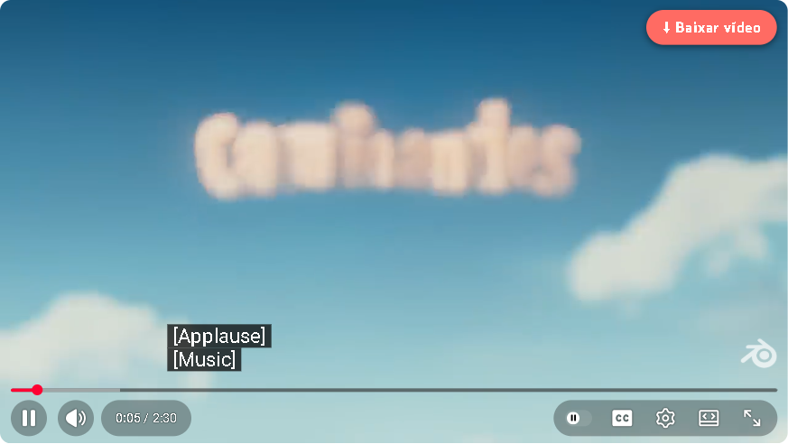
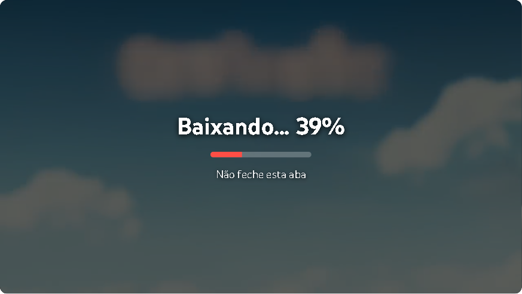

# Baixar vídeo (karaokê)

🇺🇸 [English](README.md)

Fork do [Triangle-Downloader](https://github.com/HelpFreedom/Triangle-Downloader), simplificado para o meu pai — cantor amador de karaokê que usa o YouTube como repertório. Um botão só: **Baixar vídeo**.



Enquanto baixa (uns 10 segundos), o player fica coberto pelo quadro em que o vídeo estava, com o andamento em letras grandes:



Quando termina, o vídeo volta de onde estava e aparece o aviso com o botão **Abrir pasta**:


## O que faz

- Põe um botão **⬇ Baixar vídeo** no player do YouTube, nas páginas `youtube.com/watch`.
- Um clique salva o vídeo inteiro em MP4 720p (H.264 + AAC), com a letra na tela, título e artista gravados no arquivo, na pasta `Downloads\Músicas para cantar`. No fim aparece o botão **Abrir pasta**, que mostra o arquivo.
- Tudo acontece dentro do navegador: o vídeo que o player já está tocando é capturado e gravado num MP4 com ffmpeg.wasm, sem reconverter, então leva segundos e não minutos (uns 9 segundos para um vídeo de 2 min e meio). Sem serviço externo, sem yt-dlp, sem instalar mais nada.
- Enquanto captura, a extensão pula a posição do player para o YouTube mandar os pedaços seguintes. Por isso o player fica coberto por uma cortina (o quadro em que o vídeo estava, escurecido, com o andamento em letras grandes) até a captura acabar; sem ela, a barra corria sozinha e parecia que o vídeo estava tocando. Cliques e teclas no player ficam bloqueados nesse tempo. Depois o vídeo volta para onde estava e continua tocando, se estava tocando.
- A interface segue o idioma do Chrome: português do Brasil se o Chrome estiver em português; inglês nos demais casos.
- Uma vez por dia confere no GitHub se há versão nova e avisa.

Até a versão 1.0.0 o botão salvava um MP3. Algumas das músicas são em inglês, e nessas a letra na tela faz falta, então desde a 1.1.0 ele salva o vídeo. O repositório e o zip mantiveram o nome original.

## Requisitos

- Google Chrome (ou outro navegador Chromium que carregue extensão sem compactação). O instalador de uma linha é para Windows; em outros sistemas, descompacte a release e use "Carregar sem compactação".
- Um bloqueador de anúncios que segure os anúncios do YouTube: **uBlock Origin Lite no modo "Completo" em youtube.com**. O YouTube injeta o anúncio no mesmo fluxo do vídeo, então um anúncio que começa durante o download cancela o download (a mensagem avisa).

## Instalar (Windows)

1. Abra o PowerShell e cole esta linha:

   ```powershell
   irm https://raw.githubusercontent.com/alex-vinny/karaoke-mp3-downloader/main/install.ps1 | iex
   ```

   Ela baixa a última versão para `%LOCALAPPDATA%\KaraokeMP3\extension`, cria a pasta das músicas e dois atalhos na área de trabalho (**Músicas para cantar** e **Atualizar Baixador**), copia o caminho da extensão para a área de transferência e abre `chrome://extensions`. Não precisa de administrador.

2. Em `chrome://extensions`: ligue o **Modo do desenvolvedor** (canto superior direito) → **Carregar sem compactação** → cole o caminho (Ctrl+V) → Enter.

3. Abra qualquer vídeo no YouTube. O botão vermelho fica no canto superior direito do player.

Se o Chrome mostrar o aviso "Desativar extensões do modo de desenvolvedor" ao abrir, clique em **Cancelar**.

Instalação manual: baixe `karaoke-mp3-downloader.zip` da [última release](https://github.com/alex-vinny/karaoke-mp3-downloader/releases/latest), descompacte em qualquer pasta e use "Carregar sem compactação" como acima.

## Atualizar

Dê dois cliques em **Atualizar Baixador** na área de trabalho, feche o Chrome quando ele pedir e abra o Chrome de novo. O atalho roda uma cópia local do instalador (`%LOCALAPPDATA%\KaraokeMP3\update.cmd`), que antes de tudo busca a versão mais nova do próprio instalador no GitHub. Quando existe versão nova, a extensão mostra "Tem atualização" no YouTube uma vez por dia.

Se o atalho não abrir, ou reclamar do PowerShell (aconteceu com o atalho antigo, da versão 1.1.0), cole a linha de instalação de novo no PowerShell: ela refaz a instalação e o atalho.

## Se parar de funcionar

- O YouTube muda o player com frequência. Atualize primeiro.
- A mensagem na tela traz um código curto e a versão, por exemplo `Deu erro (E1, v1.1.0)`:
  - **E1** — a captura falhou (rede, ou o YouTube mudou algo).
  - **E2** — a gravação do arquivo falhou.
  - **"Apareceu anúncio"** — o bloqueador deixou passar um anúncio. Ponha o uBlock Origin Lite em modo "Completo" no youtube.com.
- Recarregue a página (F5) e tente de novo. Deixe a aba aberta enquanto roda; fechar a aba cancela o download.
- Continua travado? Diga para quem instalou o código, a versão e o link do vídeo.

## Limites

- Só em páginas `youtube.com/watch` (não em Shorts).
- 720p, fixo: dá para ler a letra, e uma música de 4 minutos ocupa entre 30 e 80 MB.
- Para gerar um arquivo que toque em qualquer lugar sem reconverter, a extensão diz ao YouTube que este navegador não decodifica AV1, VP9 nem Opus. Com a extensão instalada, o YouTube passa a tocar tudo em H.264: nenhuma diferença visível até 1080p, mas 1440p e 4K deixam de ser oferecidos.
- Se mesmo assim um vídeo chegar em outro codec, a extensão reconverte para H.264 — funciona, mas leva muitos minutos.
- Sem ícone na barra: tudo acontece dentro do player.

## Para desenvolvedores

```sh
npm install
npx playwright install chromium
npm test                              # testes unitários (node --test) + ponta a ponta (Playwright, com janela)
npm run test:unit                     # só os unitários; no Windows, também instala e atualiza com o install.ps1 numa pasta temporária
KMD_LANG=en-US npx playwright test    # ponta a ponta em inglês (padrão: pt-BR)
node tests/spike/codec-steering.mjs   # quais codecs o YouTube serve quando AV1/VP9/Opus somem
```

Os testes de ponta a ponta carregam `extension/` sem compactação no Chromium do Playwright e salvam dois vídeos — um de 19 segundos e um de 2 min e meio em 720p — conferindo a cortina, o MP4 (H.264 + AAC, tamanho do quadro, duração, tags) e que o player volta para onde estava, tocando. Só rodam localmente — o YouTube bloqueia IPs de datacenter. As releases são publicadas pelo GitHub Actions quando uma tag `v*` é enviada. Decisões e estado: [`specs/PLAN.md`](specs/PLAN.md) (em inglês).

## Créditos e licença

Baseado no [Triangle-Downloader](https://github.com/HelpFreedom/Triangle-Downloader), de HelpFreedom: o hook de captura e o pipeline com ffmpeg.wasm são deles; este fork tira o menu, leva o YouTube a servir H.264 + AAC para que o vídeo seja uma cópia direta, e acrescenta a pasta, as tags, os idiomas e o instalador. Licença GPL-3.0, ver [`LICENSE`](LICENSE). Usa [ffmpeg.wasm](https://github.com/ffmpegwasm/ffmpeg.wasm).
